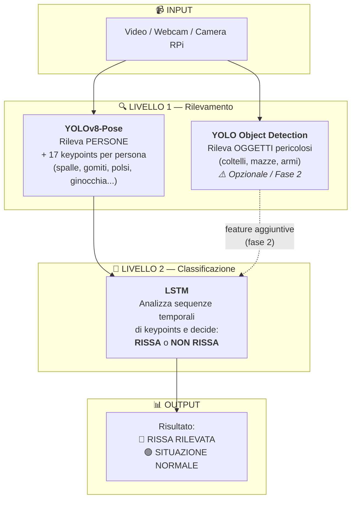
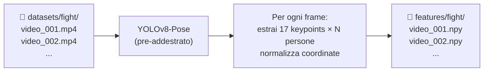
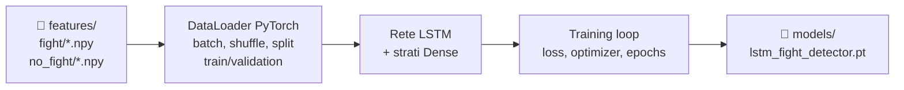
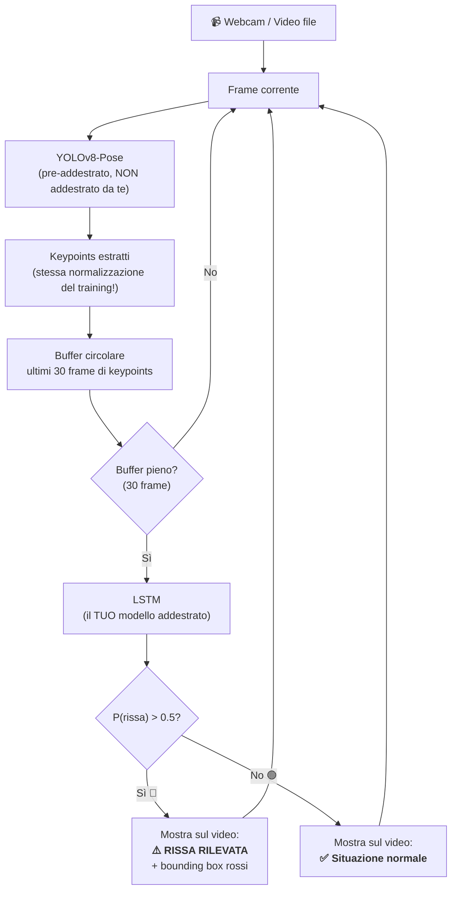
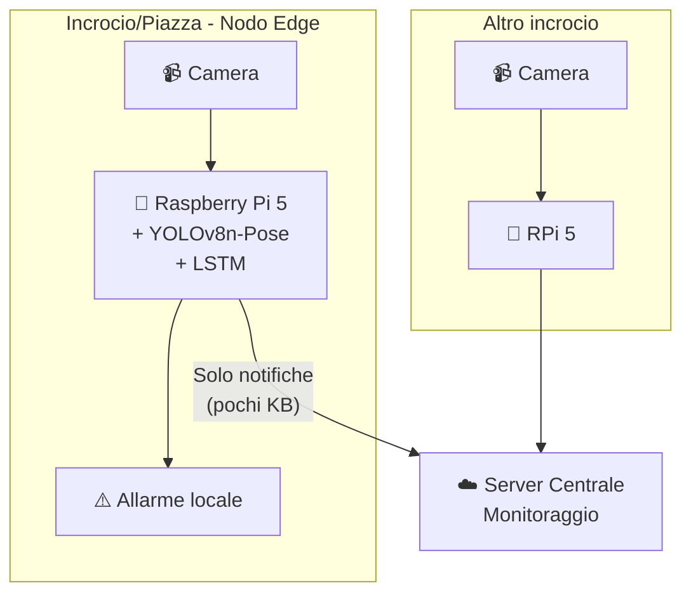
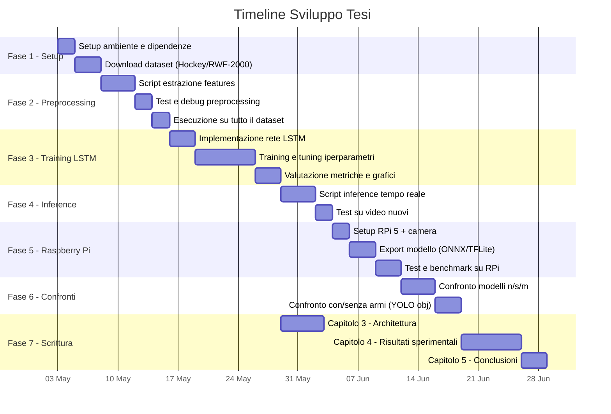

# 🎓 Piano Pratico — Tesi Triennale

## *"Riconoscimento automatico di risse in sequenze video mediante tecniche di computer vision e deep learning"*

---

## 1. Architettura del Sistema

Il sistema è composto da **3 componenti principali** che lavorano insieme:



> [!IMPORTANT]
> **Cosa devi addestrare:** Solo l'LSTM. YOLOv8-Pose e YOLO Object Detection si usano **pre-addestrati** (hanno già imparato a riconoscere persone, pose e oggetti su milioni di immagini).

---

## 2. Chiarimenti sulle Componenti

### 2.1 — YOLOv8-Pose (Pose Estimation)

| Aspetto | Dettaglio |
|---|---|
| **Cosa fa** | Rileva **persone** nel frame e ne estrae **17 keypoints** (coordinate x, y) |
| **Cosa NON fa** | ❌ Non rileva oggetti (coltelli, mazze, ecc.) |
| **Addestramento** | ❌ Non serve — si usa il modello pre-addestrato |
| **Perché non MediaPipe** | MediaPipe è pensato per **una singola persona**. Nelle risse ci sono **più persone** → YOLOv8-Pose le rileva tutte in un unico passaggio |

**I 17 keypoints (formato COCO):**

```
          0: naso
         /   \
    1: occhio_sx  2: occhio_dx
    3: orecchio_sx  4: orecchio_dx
         |
    5: spalla_sx --- 6: spalla_dx
         |               |
    7: gomito_sx     8: gomito_dx
         |               |
    9: polso_sx     10: polso_dx
         |
   11: anca_sx  --- 12: anca_dx
         |               |
   13: ginocchio_sx 14: ginocchio_dx
         |               |
   15: caviglia_sx  16: caviglia_dx
```

### 2.2 — YOLO Object Detection (Armi/Oggetti)

| Aspetto | Dettaglio |
|---|---|
| **Cosa fa** | Rileva **oggetti pericolosi** (coltelli classe 43, mazze classe 34, ecc.) |
| **Priorità** | ⚠️ **Fase 2** — puoi aggiungerlo dopo. Il cuore della tesi è Pose + LSTM |
| **Addestramento** | Per COCO classes (coltelli, mazze) → pre-addestrato. Per armi specifiche → serve fine-tuning |

### 2.3 — LSTM (Long Short-Term Memory)

| Aspetto | Dettaglio |
|---|---|
| **Cosa fa** | Riceve **sequenze temporali** di keypoints e classifica: rissa o no |
| **Addestramento** | ✅ **SÌ — Questo è il cuore della tua tesi** |
| **Input** | Sequenza di N frame, ognuno con le coordinate dei keypoints di tutte le persone |
| **Output** | Probabilità: 0.0 (nessuna rissa) → 1.0 (rissa certa) |

> [!NOTE]
> **Perché LSTM?** Perché una rissa è un **evento temporale**: un singolo frame con un braccio alzato non dice nulla. Servono più frame consecutivi per capire se è un pugno, un saluto o uno stretching. L'LSTM analizza la **sequenza nel tempo**.

---

## 3. Scelta del Modello — Dimensioni (IMPORTANTE!)

Le varianti di YOLO differiscono per dimensione e impattano **sia il training che l'inference**:

```
yolo26n-pose  →  NANO     ████░░░░░░░░░░░░  ~2.5M parametri   → Più veloce, meno preciso
yolo26s-pose  →  SMALL    ██████░░░░░░░░░░  ~7M parametri
yolo26m-pose  →  MEDIUM   █████████░░░░░░░  ~20M parametri
yolo26l-pose  →  LARGE    ████████████░░░░  ~44M parametri
yolo26x-pose  →  EXTRA    ████████████████  ~68M parametri   → Più lento, più preciso
```

### Impatto pratico:

| Scenario | Modello consigliato | Perché |
|---|---|---|
| **Sviluppo/test sul tuo PC** (RTX 4070) | `yolo26x-pose` va bene | Hai la potenza per farlo girare |
| **Deploy su Raspberry Pi 5** | `yolo26n-pose` (nano) | L'unico abbastanza leggero |
| **Risultati nella tesi** | `yolo26n-pose` | I numeri che presenti devono corrispondere al modello deployato |

> [!WARNING]
> **Errore comune:** Sviluppare con il modello `x` (extra) e poi presentare quei risultati nella tesi dicendo che gira su Raspberry Pi. Non funziona! Il modello `x` è troppo pesante. Usa `n` (nano) fin dall'inizio per coerenza.

### Strategia consigliata per la tesi:

Usa `yolo26n-pose` come modello **principale**, ma nella sezione sperimentale fai un **confronto**:

| Modello | Accuratezza | FPS su PC | FPS su RPi 5 | Parametri |
|---|---|---|---|---|
| `yolo26n-pose` | da misurare | da misurare | da misurare | ~2.5M |
| `yolo26s-pose` | da misurare | da misurare | da misurare | ~7M |
| `yolo26m-pose` | da misurare | da misurare | — | ~20M |

Questo confronto è un **contributo sperimentale** di valore per la tesi.

---

## 4. Struttura del Progetto — I 3 Programmi

```
testAI/
├── 📁 datasets/                    # Video e dati
│   ├── 📁 fight/                   # Video di risse
│   └── 📁 no_fight/                # Video normali
│
├── 📁 features/                    # Output del preprocessing
│   ├── 📁 fight/                   # Sequenze keypoints (rissa)
│   └── 📁 no_fight/                # Sequenze keypoints (no rissa)
│
├── 📁 models/                      # Modelli salvati
│   ├── yolo26n-pose.pt             # YOLO-Pose pre-addestrato
│   ├── yolo26n.pt                  # YOLO Objects pre-addestrato (fase 2)
│   └── lstm_fight_detector.pt      # IL TUO modello LSTM addestrato
│
├── 📄 01_extract_features.py       # PROGRAMMA 1 — Preprocessing
├── 📄 02_train_lstm.py             # PROGRAMMA 2 — Training
├── 📄 03_inference.py              # PROGRAMMA 3 — Test / Demo
│
└── 📄 requirements.txt             # Dipendenze Python
```

---

## 5. Programma 1 — `01_extract_features.py` (Preprocessing)

### Cosa fa:
Prende tutti i video del dataset, esegue YOLOv8-Pose frame per frame, e salva le sequenze di keypoints come file `.npy` (array NumPy).

### Flusso:



### Dettagli tecnici:

- **Finestra temporale:** Ogni sequenza = 30-60 frame consecutivi (1-2 secondi di video)
- **Normalizzazione:** Le coordinate (x, y) vanno normalizzate rispetto alle dimensioni del frame (0.0 → 1.0)
- **Multi-persona:** Si tracciano le prime N persone (es. max 6), ordinate per dimensione del bounding box
- **Padding:** Se in un frame ci sono meno di N persone, si riempie con zeri

### Formato dati output:

```
Per ogni video → file .npy con shape:

(num_sequenze, lunghezza_sequenza, num_features)

Esempio: (10, 30, 204)
          │    │    │
          │    │    └── 6 persone × 17 keypoints × 2 (x,y) = 204
          │    └── 30 frame per sequenza
          └── 10 sequenze estratte dal video
```

> [!TIP]
> **Perché salvare su file?** Perché eseguire YOLOv8-Pose su migliaia di video richiede **ore**. Lo fai UNA SOLA VOLTA, salvi i risultati, e poi il training dell'LSTM usa direttamente i file `.npy` — che si caricano in millisecondi.

---

## 6. Programma 2 — `02_train_lstm.py` (Training)

### Cosa fa:
Carica le features pre-estratte, addestra la rete LSTM, e salva il modello addestrato.

### Flusso:



### Architettura della rete LSTM:

```
Input (204 features per frame)
        │
        ▼
┌─────────────────────┐
│  LSTM Layer 1       │  128 unità, dropout 0.3
│  (analizza sequenza)│
└─────────────────────┘
        │
        ▼
┌─────────────────────┐
│  LSTM Layer 2       │  64 unità, dropout 0.3
│  (affina pattern)   │
└─────────────────────┘
        │
        ▼
┌─────────────────────┐
│  Dense (FC) Layer   │  32 neuroni, ReLU
└─────────────────────┘
        │
        ▼
┌─────────────────────┐
│  Output Layer       │  1 neurone, Sigmoid
│  → P(rissa)         │  0.0 = no rissa, 1.0 = rissa
└─────────────────────┘
```

### Iperparametri da sperimentare:

| Parametro | Valore iniziale | Range da esplorare |
|---|---|---|
| Learning rate | 0.001 | 0.0001 → 0.01 |
| Batch size | 32 | 16, 32, 64 |
| Sequenza (frame) | 30 | 15, 30, 60 |
| LSTM hidden size | 128 | 64, 128, 256 |
| Numero LSTM layers | 2 | 1, 2, 3 |
| Dropout | 0.3 | 0.2, 0.3, 0.5 |
| Epoche | 50 | con early stopping |

> [!NOTE]
> **Questo programma lo eseguirai MOLTE VOLTE**, cambiando iperparametri per trovare la configurazione migliore. Per questo è separato dal preprocessing — non vuoi rieseguire ore di estrazione features ogni volta.

### Metriche da registrare (per la tesi):

- **Accuracy** (percentuale di predizioni corrette)
- **Precision** (quante risse previste sono vere risse)
- **Recall** (quante risse reali sono state trovate)
- **F1-Score** (media armonica di precision e recall)
- **Confusion Matrix** (matrice di confusione)
- **Loss curves** (grafici training loss vs validation loss)

---

## 7. Programma 3 — `03_inference.py` (Test / Demo)

### Cosa fa:
Carica il modello LSTM addestrato, riceve video (file o webcam) in tempo reale, e mostra il risultato sullo schermo.

### Perché serve YOLO-Pose anche qui?

> [!IMPORTANT]
> **L'LSTM non capisce i video.** Capisce solo sequenze di numeri (coordinate keypoints). Senza YOLO-Pose, l'LSTM non riceve nessun dato utile. Il flusso è SEMPRE:
>
> `Frame → YOLO-Pose → Coordinate → LSTM → Risultato`
>
> YOLO-Pose è il **traduttore** tra il mondo visivo e il mondo numerico dell'LSTM.

### Flusso in tempo reale:



### Modalità di utilizzo:

```
# Modalità 1: Test su file video
python 03_inference.py --source video_test.mp4

# Modalità 2: Webcam in tempo reale (sul PC)
python 03_inference.py --source 0

# Modalità 3: Camera Raspberry Pi (sul RPi 5)
python 03_inference.py --source 0 --device cpu
```

---

## 8. Raspberry Pi — Deploy e Smart City

### Perché è interessante per la tesi?

Il deploy su Raspberry Pi trasforma la tesi da un **esercizio accademico** a un **prototipo reale per smart city**. Questo dimostra:

1. **Applicabilità pratica** — Non è solo teoria, funziona su hardware economico
2. **Edge Computing** — L'elaborazione avviene sul dispositivo, senza inviare video al cloud (privacy!)
3. **Scalabilità** — Ogni telecamera ha il suo RPi, sistema distribuito
4. **Costo contenuto** — Un RPi 5 + camera costa ~100€ vs migliaia per un server GPU

### Scenario smart city:



> [!TIP]
> **Argomento forte per la relatrice:** *"Il sistema elabora tutto localmente sul Raspberry Pi. Non invia video al cloud, rispettando la privacy dei cittadini (GDPR). Al server centrale arriva solo una notifica testuale quando viene rilevata una rissa."*

### Hardware necessario:

| Componente | Modello | Costo stimato | Note |
|---|---|---|---|
| **Raspberry Pi** | Pi 5 (4GB o 8GB) | ~60-80€ | ❌ Il Pi 3B non è sufficiente |
| **Camera** | Pi Camera Module 3 | ~25-35€ | Oppure una webcam USB qualsiasi |
| **Alimentatore** | USB-C 27W ufficiale | ~12€ | |
| **MicroSD** | 32GB+ classe A2 | ~10€ | Per il sistema operativo |

### Come chiedere alla relatrice:

> *"Professoressa, per la parte di deployment del sistema su edge device vorrei dimostrare che il modello funziona in tempo reale su un Raspberry Pi 5, inquadrandolo come prototipo per smart city. Il Raspberry Pi 3B che ho purtroppo non ha risorse sufficienti per eseguire modelli di pose estimation. Sarebbe possibile ottenere dal dipartimento un Raspberry Pi 5 con un modulo camera per i test finali?"*

---

## 9. Dataset Consigliati

Per addestrare l'LSTM servono video etichettati come "rissa" e "non rissa":

| Dataset | Dimensione | Descrizione | Link |
|---|---|---|---|
| **RWF-2000** | 2000 video | 1000 fight + 1000 non-fight, da telecamere di sorveglianza | Molto usato in letteratura |
| **UBI-Fights** | 1000 video | Diversi scenari urbani | Buona varietà |
| **Hockey Fights** | 1000 video | 500 fight + 500 non-fight | Più facile, buono per iniziare |
| **Surveillance Camera Fight** | ~300 video | Da CCTV reali | Realistico |

> [!TIP]
> **Inizia con Hockey Fights** per validare la pipeline (è più semplice), poi passa a **RWF-2000** per i risultati finali della tesi (è lo standard nella letteratura).

---

## 10. Timeline di Sviluppo Consigliata



---

## 11. Riassunto Decisioni Chiave

| Decisione | Scelta | Motivazione |
|---|---|---|
| Pose estimation | **YOLOv8-Pose** (non MediaPipe) | Supporto multi-persona nativo |
| Dimensione modello | **`yolo26n-pose`** (nano) | Compatibilità con Raspberry Pi 5 |
| Classificatore temporale | **LSTM** | Analisi di sequenze temporali |
| Rilevamento armi | **Fase 2** (opzionale) | Il cuore è Pose + LSTM |
| Framework | **PyTorch** | Più flessibile, ottimo ecosistema |
| Edge device | **Raspberry Pi 5** | Costo contenuto, adatto a smart city |
| Dataset principale | **RWF-2000** | Standard in letteratura |

---

## 12. Stack Tecnologico

```
Python 3.10+
├── ultralytics          # YOLOv8-Pose e YOLO Object Detection
├── torch / torchvision  # PyTorch per LSTM
├── opencv-python        # Lettura video e visualizzazione
├── numpy                # Manipolazione array keypoints
├── scikit-learn         # Metriche, split train/test
├── matplotlib / seaborn # Grafici per la tesi
└── onnxruntime          # (opzionale) Per inference su RPi
```
